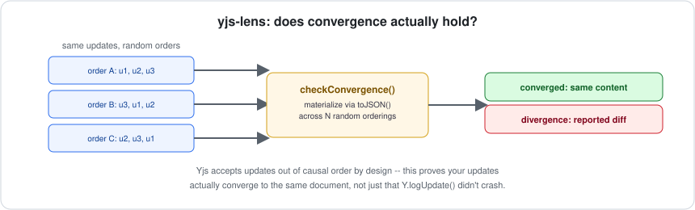
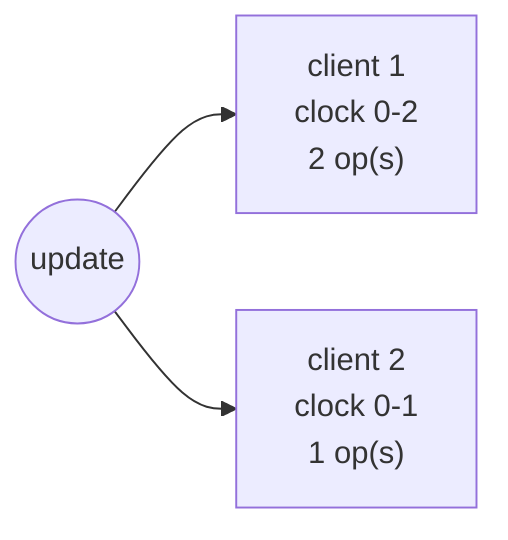

# yjs-lens

[](https://github.com/jayblast-spec/yjs-lens/actions/workflows/ci.yml)
[](https://www.npmjs.com/package/yjs-lens)
[](./LICENSE)
[](https://yjs-lens.vercel.app)



**Verifies the convergence guarantee actually holds for a set of [Yjs](https://yjs.dev) updates, and summarizes causal update history — debugging tooling for Yjs beyond `Y.logUpdate()`.**

## The gap this fills

Yjs is the most widely-deployed CRDT in production (Tiptap, BlockNote, Jupyter real-time collaboration, and many more). Its own debugging surface is thin by design: `Y.logUpdate()` prints an update's contents to the console, and that's essentially it in the open-source ecosystem. A commercial hosted dashboard (Liveblocks) can inspect document state, but only inside its own platform — there's nothing open-source and framework-agnostic that answers the one question that actually matters for a CRDT: **did this set of updates actually converge to the same result no matter what order they were applied in?**

## What it does

Two pieces, both built only on Yjs's stable, documented public API:

### `checkConvergence(updates, options)`
Applies a flat set of updates (gathered from any number of diverged replicas) to fresh docs in many random orders — Yjs is explicitly designed to accept updates out of causal order, so this is a real code path, not a contrived one — and asserts every ordering converges to the same materialized content. Compares *materialized content*, not raw encoded bytes: two Yjs docs can be logically identical while their internal struct representation differs, so byte comparison would produce false positives. Runs are seeded for reproducibility.

### `summarizeUpdate(update)`
Yjs represents causal history as per-client clock ranges rather than Automerge-style discrete named changes. This surfaces that structure directly: which client IDs contributed to an update, and what clock range (how many ops) each one covers.

### `updateSummaryToMermaid(summary)`
Renders a `summarizeUpdate` result as a [Mermaid](https://mermaid.js.org) diagram — paste into a ` ```mermaid ` fenced block anywhere that renders Markdown (GitHub does this natively) instead of reading a table of client IDs and clock ranges:



## Install

```bash
npm install yjs-lens yjs
```

## Usage

```ts
import * as Y from "yjs";
import { checkConvergence, summarizeUpdate } from "yjs-lens";

const updates = [/* gathered from diverged replicas */];
const result = checkConvergence(updates);
if (!result.converged) {
  throw new Error(`convergence violated: ${JSON.stringify(result.divergence)}`);
}

for (const c of summarizeUpdate(updates[0])) {
  console.log(`client ${c.client}: ops ${c.fromClock}-${c.toClock}`);
}
```

Run the annotated demo:

```bash
npx tsx examples/demo.ts
```

## Design notes

- **`checkConvergence` materializes state via `Doc.toJSON()` by default.** That method is marked deprecated in Yjs (in favor of calling `toJSON()` on individual shared types you already know about), but it remains the only generic way to serialize an entire doc's content without knowing its schema ahead of time, and it is not removed. Pass your own `materialize` function if you'd rather not depend on it.
- **No conflict-explanation feature, unlike this project's Automerge sibling ([automerge-lens](https://github.com/jayblast-spec/automerge-lens)).** Automerge exposes a public `getConflicts()` API that names every candidate value and its author for a resolved key. Yjs's equivalent resolution logic lives in internal, unstable struct-store fields (`Item`, private map fields) that aren't part of its public API contract. Rather than depend on internals that could break on any Yjs patch release, this ships only what the stable API actually supports.

## Non-goals (v1)

- Conflict/winner explanation (see above — not safely buildable on stable API).
- A live, interactive UI — `updateSummaryToMermaid` produces static diagram source you render yourself.
- Y.Text / rich-text-specific diffing beyond what generic content materialization gives you.

## Development

```bash
npm install
npm run typecheck
npm test
npm run build
```

## License

MIT

---

Built by [ArkNet Digital](https://github.com/jayblast-spec).
